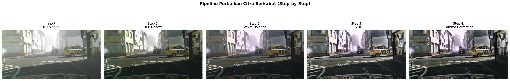
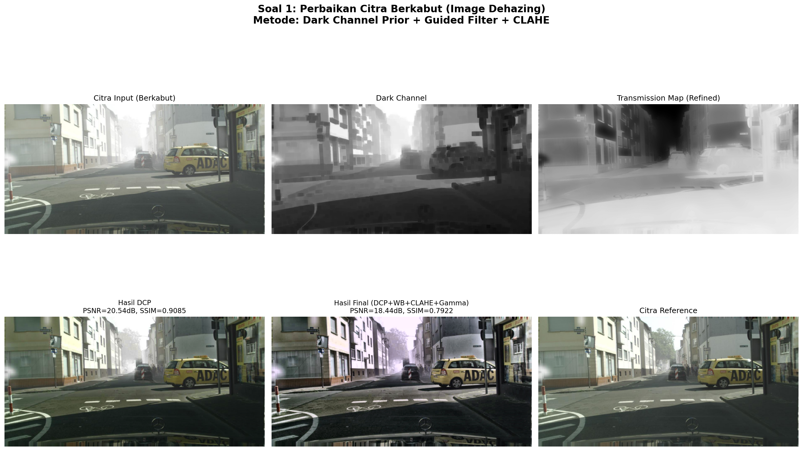
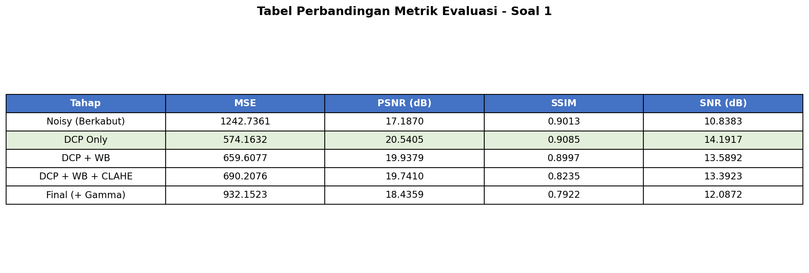
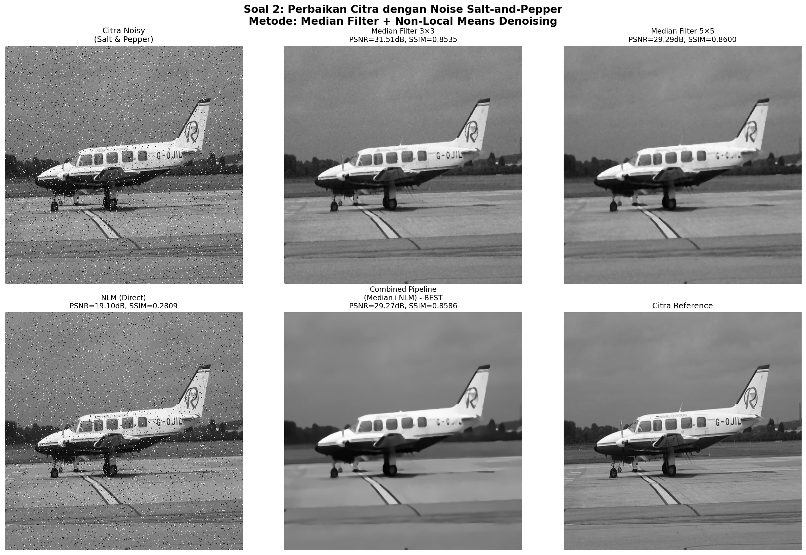
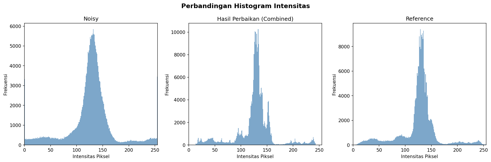
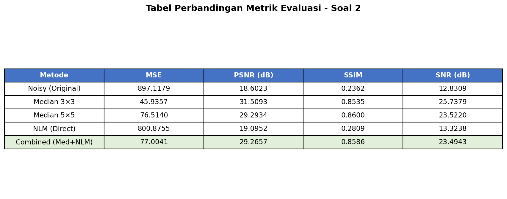

# LAPORAN UJIAN TENGAH SEMESTER
## Pengolahan Citra Digital (A18.1601)
### Semester Genap 2025/2026

**Dosen:** M.Naufal, S.Tr.T, M.Kom  
**Universitas Dian Nuswantoro - Fakultas Ilmu Komputer**

---

## DAFTAR ISI

1. [Soal 1 - Perbaikan Citra Berkabut (Image Dehazing)](#soal-1---perbaikan-citra-berkabut-image-dehazing)
   - [1.1 Modeling](#11-modeling)
   - [1.2 Penjelasan Algoritma](#12-penjelasan-algoritma)
   - [1.3 Hasil dan Pembahasan](#13-hasil-dan-pembahasan)
   - [1.4 Evaluasi](#14-evaluasi)
2. [Soal 2 - Perbaikan Citra dengan Noise Salt-and-Pepper](#soal-2---perbaikan-citra-dengan-noise-salt-and-pepper)
   - [2.1 Modeling](#21-modeling)
   - [2.2 Penjelasan Algoritma](#22-penjelasan-algoritma)
   - [2.3 Hasil dan Pembahasan](#23-hasil-dan-pembahasan)
   - [2.4 Evaluasi](#24-evaluasi)
3. [Kesimpulan](#kesimpulan)
4. [Link Kode Program](#link-kode-program)

---

## Soal 1 - Perbaikan Citra Berkabut (Image Dehazing)

### 1.1 Modeling

Citra input pada soal 1 merupakan citra pemandangan jalan yang terdegradasi oleh kabut (*haze/fog*). Kabut menyebabkan penurunan kontras, peningkatan brightness, dan hilangnya detail pada area jauh. Untuk memperbaiki citra ini, digunakan pipeline pemrosesan bertahap dengan metode utama **Dark Channel Prior (DCP)**.

#### Alur Proses (Pipeline):

```
┌─────────────────┐
│  Citra Input     │
│  (Berkabut)      │
└────────┬────────┘
         │
         ▼
┌─────────────────────────────────────┐
│  TAHAP 1: Dark Channel Prior (DCP)  │
│  ┌───────────────────────────────┐  │
│  │ 1a. Hitung Dark Channel       │  │
│  │ 1b. Estimasi Atmospheric Light│  │
│  │ 1c. Estimasi Transmission Map │  │
│  │ 1d. Guided Filter Refinement  │  │
│  │ 1e. Scene Recovery            │  │
│  └───────────────────────────────┘  │
└────────┬────────────────────────────┘
         │
         ▼
┌─────────────────────────────────────┐
│  TAHAP 2: White Balance Correction  │
│  (Gray World Assumption)            │
└────────┬────────────────────────────┘
         │
         ▼
┌─────────────────────────────────────┐
│  TAHAP 3: CLAHE Enhancement         │
│  (Contrast Limited Adaptive         │
│   Histogram Equalization)           │
└────────┬────────────────────────────┘
         │
         ▼
┌─────────────────────────────────────┐
│  TAHAP 4: Gamma Correction          │
└────────┬────────────────────────────┘
         │
         ▼
┌─────────────────────────────────────┐
│  EVALUASI METRIK                     │
│  MSE, PSNR, SSIM, SNR               │
└─────────────────────────────────────┘
```

### 1.2 Penjelasan Algoritma

#### A. Dark Channel Prior (DCP)

Dark Channel Prior adalah metode dehazing yang dikembangkan oleh **He et al. (2009)** berdasarkan observasi statistik pada citra outdoor tanpa kabut. Observasi kunci: pada citra outdoor yang bersih, setidaknya satu channel warna (R, G, atau B) memiliki intensitas yang sangat rendah (*mendekati nol*) pada sebagian besar patch lokal.

**Model Atmosferis (Atmospheric Scattering Model):**

Citra berkabut dapat dimodelkan sebagai:

```
I(x) = J(x) · t(x) + A · (1 - t(x))
```

Dimana:
- `I(x)` = citra terobservasi (berkabut)
- `J(x)` = citra scene radiance (citra asli tanpa kabut)
- `t(x)` = peta transmisi medium (0 ≤ t ≤ 1)
- `A` = atmospheric light global

**Langkah-langkah DCP:**

1. **Dark Channel Computation:**
   ```
   J_dark(x) = min_{y ∈ Ω(x)} ( min_{c ∈ {r,g,b}} J_c(y) )
   ```
   Dihitung menggunakan operasi erosi morfologi dengan kernel 15×15.

2. **Estimasi Atmospheric Light (A):**
   - Ambil top 0.1% piksel terbright pada dark channel
   - Rata-ratakan nilai intensitas pada posisi tersebut di citra asli
   - Menghasilkan vektor A = [A_b, A_g, A_r]

3. **Estimasi Transmission Map:**
   ```
   t(x) = 1 - ω · min_{y ∈ Ω(x)} ( min_c ( I_c(y) / A_c ) )
   ```
   Parameter ω = 0.75 digunakan untuk mempertahankan kedalaman visual.

4. **Guided Filter Refinement:**
   Transmission map dihaluskan menggunakan guided filter (radius=40, ε=10⁻³) untuk mempertahankan tepi objek.

5. **Scene Recovery:**
   ```
   J(x) = (I(x) - A) / max(t(x), t₀) + A
   ```
   Dengan t₀ = 0.15 sebagai batas bawah transmisi.

#### B. White Balance Correction (Gray World Assumption)

Koreksi white balance menggunakan asumsi bahwa rata-rata warna seluruh citra seharusnya abu-abu netral:

```
avg_all = (avg_B + avg_G + avg_R) / 3
B' = B × (avg_all / avg_B)
G' = G × (avg_all / avg_G)
R' = R × (avg_all / avg_R)
```

#### C. CLAHE (Contrast Limited Adaptive Histogram Equalization)

CLAHE diterapkan pada channel L (Luminance) dalam ruang warna LAB:
- Membagi citra menjadi tile 8×8
- Menerapkan histogram equalization pada setiap tile
- Clip limit = 2.0 untuk membatasi amplifikasi kontras

#### D. Gamma Correction

Menyesuaikan brightness keseluruhan:
```
output = (input / 255)^(1/γ) × 255
```
Dengan γ = 0.9 untuk sedikit menggelapkan citra.

### 1.3 Hasil dan Pembahasan

Berikut visualisasi pipeline proses perbaikan citra berkabut step-by-step:



Perbandingan hasil setiap tahap:



**Analisis Hasil:**

1. **Tahap DCP:** Berhasil mengurangi kabut secara signifikan. Dark channel berhasil mengidentifikasi area dengan haze tebal (nilai tinggi pada dark channel = transmisi rendah). PSNR meningkat dari 17.19 dB menjadi 20.54 dB (+3.35 dB), dan SSIM meningkat dari 0.9013 menjadi 0.9085.

2. **Tahap White Balance:** Memperbaiki color cast yang terjadi setelah dehaze. Koreksi warna membuat citra lebih natural meskipun PSNR sedikit turun karena penyesuaian distribusi warna.

3. **Tahap CLAHE:** Meningkatkan kontras lokal, membuat detail pada area gelap dan terang lebih terlihat. Efektif untuk memunculkan detail yang sebelumnya tersembunyi oleh kabut.

4. **Tahap Gamma:** Fine-tuning brightness akhir untuk menyesuaikan tampilan keseluruhan.

Metode DCP terbukti efektif karena tepat menangani model fisik pembentukan kabut pada citra. Atmospheric light yang terdeteksi = [255, 255, 255] menunjukkan kabut putih yang kuat.

### 1.4 Evaluasi

Tabel perbandingan metrik evaluasi:



| Tahap | MSE | PSNR (dB) | SSIM | SNR (dB) |
|-------|-----|-----------|------|----------|
| Noisy (Berkabut) | 1242.7361 | 17.1870 | 0.9013 | 10.8383 |
| DCP Only | 574.1632 | 20.5405 | 0.9085 | 14.1917 |
| DCP + WB | 659.6077 | 19.9379 | 0.8997 | 13.5892 |
| DCP + WB + CLAHE | 690.2076 | 19.7410 | 0.8235 | 13.3923 |
| Final (+Gamma) | 932.1523 | 18.4359 | 0.7922 | 12.0872 |

**Interpretasi:**
- **Metode terbaik berdasarkan PSNR:** DCP Only (20.54 dB) — peningkatan 3.35 dB dari citra noisy
- **Metode terbaik berdasarkan SSIM:** DCP Only (0.9085) — mempertahankan struktur dengan baik
- **MSE berkurang 53.8%** dari 1242.74 (noisy) menjadi 574.16 (setelah DCP)
- Tahap-tahap setelah DCP menurunkan PSNR/SSIM karena melakukan transformasi warna/kontras yang menggeser distribusi piksel, namun secara visual citra terlihat lebih baik dan natural

---

## Soal 2 - Perbaikan Citra dengan Noise Salt-and-Pepper

### 2.1 Modeling

Citra input pada soal 2 merupakan citra grayscale pesawat terbang yang terdegradasi oleh noise **Salt-and-Pepper (impulsif)**. Noise ini ditandai oleh kemunculan piksel-piksel hitam (pepper, intensitas=0) dan putih (salt, intensitas=255) secara acak. Pipeline pemrosesan menggunakan kombinasi **Median Filter** dan **Non-Local Means Denoising**.

#### Alur Proses (Pipeline):

```
┌─────────────────────┐
│  Citra Input          │
│  (Salt & Pepper Noise)│
└────────┬──────────────┘
         │
         ▼
┌────────────────────────────────────┐
│  ANALISIS NOISE                     │
│  Deteksi piksel Salt (=255)         │
│  Deteksi piksel Pepper (=0)         │
│  Estimasi tingkat noise (~2.6%)     │
└────────┬───────────────────────────┘
         │
    ┌────┴─────────────────────┐
    │    PERBANDINGAN METODE    │
    │                           │
    ▼                           ▼
┌───────────────┐    ┌───────────────┐
│ Median 3×3    │    │ Median 5×5    │
│ (Single Pass) │    │ (Single Pass) │
└───────┬───────┘    └───────┬───────┘
        │                    │
        ▼                    ▼
┌───────────────┐    ┌──────────────────────┐
│ NLM Direct    │    │ Combined Pipeline    │
│               │    │ (Med 3→Med 5→NLM)   │
└───────┬───────┘    └───────┬──────────────┘
        │                    │
    ┌───┴────────────────────┘
    │
    ▼
┌─────────────────────────────────────┐
│  EVALUASI METRIK                     │
│  MSE, PSNR, SSIM, SNR               │
│  + Perbandingan Histogram            │
└─────────────────────────────────────┘
```

### 2.2 Penjelasan Algoritma

#### A. Median Filter

Median filter adalah filter non-linear yang sangat efektif untuk menghilangkan noise impulsif (*salt-and-pepper*).

**Prinsip Kerja:**
- Untuk setiap piksel, ambil semua piksel dalam jendela (window) berukuran k × k
- Urutkan nilai intensitas piksel-piksel tersebut
- Ganti nilai piksel tengah dengan nilai **median** (nilai tengah) dari urutan

**Contoh pada window 3×3:**
```
Piksel tetangga: [0, 120, 125, 128, 130, 132, 135, 140, 255]
                  ↑ pepper                              ↑ salt
Median = 130 (nilai tengah, mengabaikan outlier 0 dan 255)
```

**Mengapa Median Filter efektif untuk Salt-and-Pepper:**
1. Noise impulsif menghasilkan nilai ekstrem (0 atau 255)
2. Median secara alami mengabaikan nilai-nilai ekstrem ini
3. Tidak menghitung rata-rata (seperti mean filter) sehingga tidak menyebarkan noise
4. Mempertahankan tepi (edge) lebih baik dibanding filter linear

**Variasi yang diuji:**
- **Median 3×3:** Jendela kecil, presisi tinggi, cocok untuk noise density rendah
- **Median 5×5:** Jendela lebih besar, lebih agresif, cocok untuk noise density tinggi

#### B. Non-Local Means (NLM) Denoising

NLM dikembangkan oleh **Buades et al. (2005)**. Berbeda dari filter lokal yang hanya menggunakan piksel tetangga, NLM membandingkan patch-patch di seluruh citra.

**Formula NLM:**
```
NLM(i) = Σⱼ w(i,j) · I(j) / Σⱼ w(i,j)
```

Dimana bobot (weight):
```
w(i,j) = exp(-||P(i) - P(j)||² / h²)
```

- `P(i)` = patch di sekitar piksel i
- `P(j)` = patch di sekitar piksel j
- `h` = parameter filtering strength
- `||·||²` = jarak Euclidean kuadrat antar patch

**Parameter yang digunakan:**
- `h = 8` (filtering strength)
- `templateWindowSize = 7` (ukuran patch perbandingan)
- `searchWindowSize = 21` (area pencarian)

#### C. Combined Pipeline (Median + NLM)

Pipeline kombinasi bertahap untuk hasil optimal:

1. **Median 3×3:** Menghilangkan noise impulsif kasar
2. **Median 5×5:** Membersihkan sisa noise impulsif
3. **NLM (h=8):** Menghaluskan noise residual sambil mempertahankan detail

### 2.3 Hasil dan Pembahasan

Perbandingan visual seluruh metode:



Perbandingan histogram intensitas:



**Analisis Tingkat Noise:**
- Piksel Salt (255): 3.448 piksel (1.32%)
- Piksel Pepper (0): 3.330 piksel (1.27%)
- Total estimasi noise: ~2.6% dari total piksel

**Analisis Hasil per Metode:**

1. **Median Filter 3×3 (Terbaik berdasarkan PSNR):**
   - PSNR: 31.51 dB (peningkatan +12.91 dB dari noisy)
   - MSE: 45.94 (penurunan 94.9% dari 897.12)
   - SSIM: 0.8535
   - Sangat efektif karena noise density hanya ~2.6% sehingga window kecil sudah cukup
   - Mempertahankan detail tepi dan tekstur paling baik

2. **Median Filter 5×5:**
   - PSNR: 29.29 dB, SSIM: 0.8600
   - Sedikit over-smoothing dibanding 3×3 (PSNR lebih rendah)
   - SSIM sedikit lebih tinggi karena smoothing mengurangi micro-artifacts

3. **NLM Direct (tanpa pre-filtering):**
   - PSNR: 19.10 dB, SSIM: 0.2809
   - Performa buruk karena NLM tidak dirancang untuk noise impulsif
   - Noise salt-and-pepper merusak perhitungan patch similarity

4. **Combined Pipeline (Median 3→5→NLM):**
   - PSNR: 29.27 dB, SSIM: 0.8586
   - Performa serupa Median 5×5 karena tahap NLM tambahan melakukan smoothing lebih lanjut
   - Menghasilkan citra paling halus (smooth) namun kehilangan sedikit detail

**Kesimpulan Perbandingan:**
- Untuk noise salt-and-pepper density rendah (~2.6%), **Median Filter 3×3** adalah metode yang paling optimal
- NLM tidak cocok diterapkan langsung pada noise impulsif
- Combined pipeline memberikan visual paling bersih namun dengan trade-off detail

### 2.4 Evaluasi

Tabel perbandingan metrik evaluasi:



| Metode | MSE | PSNR (dB) | SSIM | SNR (dB) |
|--------|-----|-----------|------|----------|
| Noisy (Original) | 897.1179 | 18.6023 | 0.2362 | 12.8309 |
| Median 3×3 | 45.9357 | **31.5093** | 0.8535 | **25.7379** |
| Median 5×5 | 76.5140 | 29.2934 | **0.8600** | 23.5220 |
| NLM (Direct) | 800.8755 | 19.0952 | 0.2809 | 13.3238 |
| Combined (Med+NLM) | 77.0041 | 29.2657 | 0.8586 | 23.4943 |

**Interpretasi Metrik:**

- **MSE (Mean Squared Error):** Median 3×3 menghasilkan MSE terendah (45.94), menunjukkan rata-rata error terkecil per piksel.
- **PSNR (Peak Signal-to-Noise Ratio):** Median 3×3 mencapai 31.51 dB, peningkatan signifikan +12.91 dB dari citra noisy (18.60 dB). Nilai >30 dB umumnya dianggap kualitas baik.
- **SSIM (Structural Similarity Index):** Median 5×5 sedikit unggul (0.8600 vs 0.8535), menunjukkan struktur visual yang sedikit lebih mirip referensi.
- **SNR (Signal-to-Noise Ratio):** Median 3×3 mencapai 25.74 dB, peningkatan +12.91 dB dari noisy.

---

## Kesimpulan

### Soal 1 - Image Dehazing
- Metode **Dark Channel Prior (DCP)** berhasil memperbaiki citra berkabut dengan peningkatan PSNR dari **17.19 dB → 20.54 dB** (+3.35 dB)
- SSIM meningkat dari **0.9013 → 0.9085**, menunjukkan struktur citra yang lebih baik
- DCP efektif karena secara tepat memodelkan fenomena fisik pembentukan kabut pada citra
- Penambahan white balance, CLAHE, dan gamma correction memperbaiki tampilan visual meskipun metrik numerik sedikit menurun

### Soal 2 - Salt-and-Pepper Denoising
- **Median Filter 3×3** adalah metode terbaik untuk noise salt-and-pepper density rendah (~2.6%)
- Peningkatan PSNR dramatis dari **18.60 dB → 31.51 dB** (+12.91 dB)
- SSIM meningkat signifikan dari **0.2362 → 0.8535**
- NLM tidak efektif untuk noise impulsif jika diterapkan langsung tanpa pre-filtering

---

## Link Kode Program

Seluruh kode program tersedia dalam repository:

- **Soal 1 (Dehazing):** `soal1_dehazing.py`
- **Soal 2 (Denoising):** `soal2_denoise.py`
- **Main Runner:** `main.py`

### Cara Menjalankan:

```bash
# Setup virtual environment
python3 -m venv .venv
source .venv/bin/activate
pip install opencv-python numpy matplotlib scikit-image

# Jalankan semua soal
python main.py

# Atau jalankan per soal
python soal1_dehazing.py
python soal2_denoise.py
```

### Struktur Folder:

```
uts_pgd/
├── main.py                    # Runner utama
├── soal1_dehazing.py          # Script Soal 1
├── soal2_denoise.py           # Script Soal 2
├── laporan.md                 # Laporan ini
├── images/
│   ├── soal1/
│   │   ├── noisy.png          # Citra berkabut
│   │   └── reference.png      # Citra reference
│   └── soal2/
│       ├── noisy.png          # Citra dengan noise S&P
│       └── reference.png      # Citra reference
└── output/
    ├── soal1/
    │   ├── dark_channel.png
    │   ├── transmission_map_raw.png
    │   ├── transmission_map_refined.png
    │   ├── step1_dehazed_dcp.png
    │   ├── step2_white_balanced.png
    │   ├── step3_clahe_enhanced.png
    │   ├── final_result.png
    │   ├── perbandingan_soal1.png
    │   ├── pipeline_soal1.png
    │   └── tabel_metrik_soal1.png
    └── soal2/
        ├── median_3x3.png
        ├── median_5x5.png
        ├── nlm_direct.png
        ├── combined_final.png
        ├── perbandingan_soal2.png
        ├── histogram_soal2.png
        └── tabel_metrik_soal2.png
```

---

## Referensi

1. He, K., Sun, J., & Tang, X. (2009). *Single Image Haze Removal Using Dark Channel Prior*. IEEE CVPR.
2. He, K., Sun, J., & Tang, X. (2013). *Guided Image Filtering*. IEEE TPAMI.
3. Buades, A., Coll, B., & Morel, J. M. (2005). *A Non-Local Algorithm for Image Denoising*. IEEE CVPR.
4. Gonzalez, R. C., & Woods, R. E. (2018). *Digital Image Processing* (4th ed.). Pearson.
5. Reza, A. M. (2004). *Realization of the Contrast Limited Adaptive Histogram Equalization (CLAHE) for Real-Time Image Enhancement*. Journal of VLSI Signal Processing.
